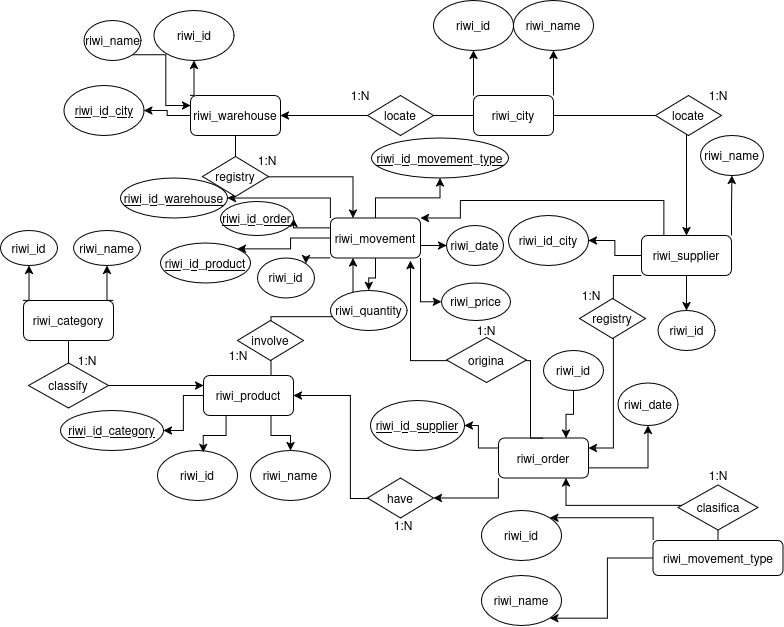
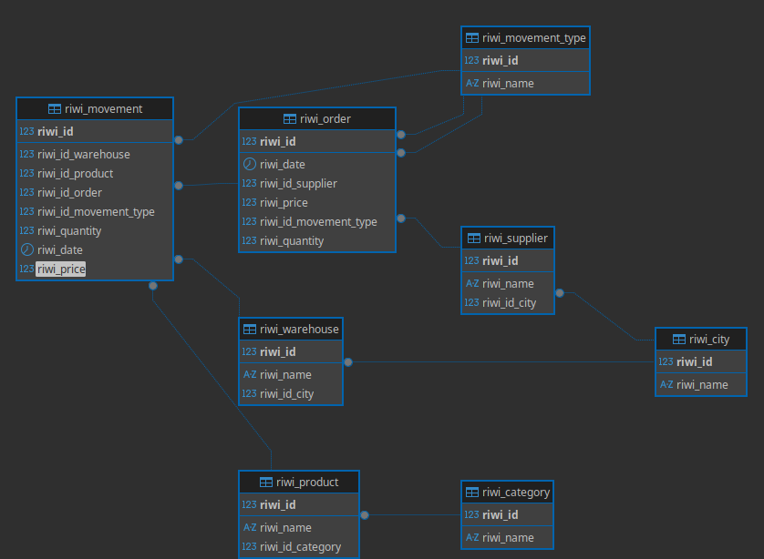

# RiwiSupply

Project description.
This project desing a database for RiwiSupply, we got 8 tables

I use PostgreSQL 16 with a docker enviroment

## Entity Relationship Model:

## relational model

To create the database and load the data, just execute the RiwiSupply.sql

[Github repository link](https://github.com/dypokkk/UH_M4)

Developer:
**Dylan Gamero - Garabato**